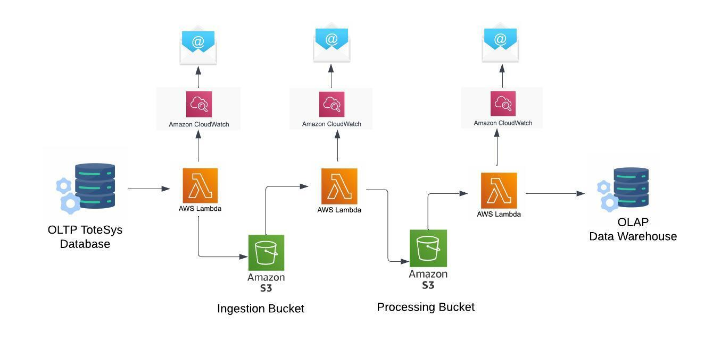

# TerrificTotes Data platform Project
This project creates a data platform, that **extracts** data from an operational (OLTP) database (called ToteSys), **transforms** it into a star-schema format, stores in a data lake, and **loads** it within a OLAP data warehouse.

## About
The project has **two S3 buckets** - an ingestion bucket and a processing bucket.

It also contains **three Lambdas**...

- **Lambda1** - extracts data from the OLTP ToteSys database, and places it as raw data, in csv format, in the ingestion bucket.
- **Lambda2** - takes data from the ingestion bucket, transforms it into star-schema format, and places it, as parquet format, in the processing bucket.
- **Lambda3** - takes data from the processing bucket and loads it within the OLAP data warehouse.

The Lambdas also have **CloudWatch alerts**, and if a serious alert is triggered an **email** is sent to: <TheTerraformers@protonmail.com>.



_Diagram depicting the internal workings and structure of the project_.

## Installation
Clone the repository:
```bash
 git clone https://github.com/DanielSolomon7/group-project-etl-data-pipeline
```

## Setup and Usage
1. Create the virtual environment:
```bash
make create-environment
```

2. Download the relevant dependencies for the project:
```bash
make requirements
```

3. Set up the dev requirements (*bandit, pip-audit, black, pytest-cov*):
```bash
make dev-setup
```

4. Run checks on the project code (*security test, black, unit tests, and coverage checks*):
```bash
make dev-setup
```

5. Prepare the lambda layers:
```bash
make layer-setup
```

6. Clean up the lambda layer dependencies:
```bash
make clean
```

7. Run all of the commands:
```bash
make all
```
